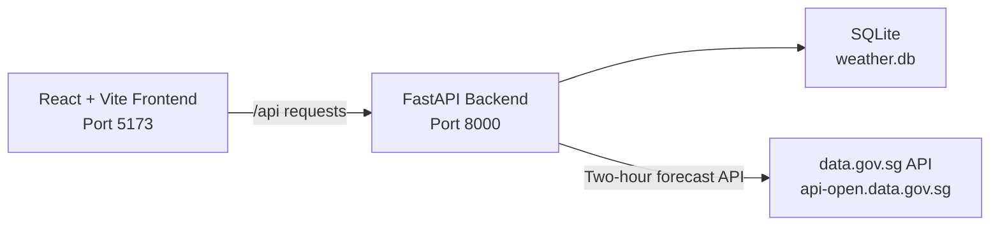

# Weather Starter

A minimal weather app starter project for agentic coding.

This starter intentionally keeps app features small while including a real external API integration so students can practice extending agent workflows around API docs, OpenAPI context, and tooling like Postman MCP.

## Tech Stack

- Backend: Python 3.11, FastAPI, SQLAlchemy, SQLite
- Frontend: React 18, Vite, Tailwind CSS, TanStack Query
- External Weather API: Singapore data.gov.sg (`api-open.data.gov.sg`)

## Architecture



## What Is Implemented

- Add a tracked location (name + latitude + longitude)
- List tracked locations
- Persist weather snapshots in SQLite
- Refresh one location explicitly via `POST /api/locations/{id}/refresh`

## External API Context (for students and agents)

- Primary docs page: [2-hour Weather Forecast](https://data.gov.sg/datasets/d_3f9e064e25005b0e42969944ccaf2e7a/view)
- Endpoint used in this app: `GET /v2/real-time/api/two-hr-forecast` on `api-open.data.gov.sg`
- App refresh endpoint: `POST /api/locations/{id}/refresh`

## Other Useful Endpoints

- Realtime weather readings docs: [Realtime Weather Readings](https://data.gov.sg/collections/realtime-weather-readings/view)
- Realtime weather readings endpoints: `GET /v2/real-time/api/air-temperature`, `GET /v2/real-time/api/relative-humidity`, `GET /v2/real-time/api/rainfall`, `GET /v2/real-time/api/wind-speed`, `GET /v2/real-time/api/wind-direction`
- Forecast docs: [Weather Forecast](https://data.gov.sg/collections/weather-forecast/view)
- Forecast endpoints: `GET /v2/real-time/api/two-hr-forecast`, `GET /v1/environment/24-hour-weather-forecast`, `GET /v1/environment/4-day-weather-forecast`

## Quick Start

Install Flox first: [https://flox.dev](https://flox.dev)

Start the Flox environment first:

```bash
flox activate
```

Then start services manually:

```bash
flox services start
```

Open [http://localhost:5173](http://localhost:5173).

Useful commands:

```bash
flox services status
flox services logs backend
flox services logs frontend
flox services stop
```

Optional:
- Set `WEATHER_API_KEY` in `backend/.env` if you want to use an API key.
- Change ports in `/Users/terencek/Development/weather-app/weather-starter/.flox/env/manifest.toml` (`BACKEND_PORT`, `FRONTEND_PORT`).

## Project Structure

```text
weather-starter/
├── .flox/
│   └── env/
│       └── manifest.toml
├── backend/
│   ├── app/
│   │   ├── main.py
│   │   ├── database.py
│   │   ├── models.py
│   │   ├── schemas.py
│   │   ├── services/
│   │   │   └── weather_api.py
│   │   └── routers/
│   │       └── locations.py
│   └── tests/
└── frontend/
    ├── src/
    │   ├── pages/
    │   └── features/locations/
    └── package.json
```

## Suggested Features

- Start here: delete a saved location (`DELETE /api/locations/{id}` + UI delete button + tests)
- Add location reordering in the UI (manual sort, persisted order field)
- Replace manual lat/lon input with Singapore area picker (`area_metadata`)
- Add nearest-area auto detection from browser geolocation
- Add 24-hour and 4-day forecast endpoints and UI tabs
- Add real-time rainfall/temperature/humidity/wind readings from data.gov.sg
- Add weather warnings/haze indicators if available from official feeds
- Add API key auth flow and error handling for 401/403/429 scenarios
- Add retry and circuit-breaker patterns for external API resilience
- Add end-to-end tests and frontend component tests
