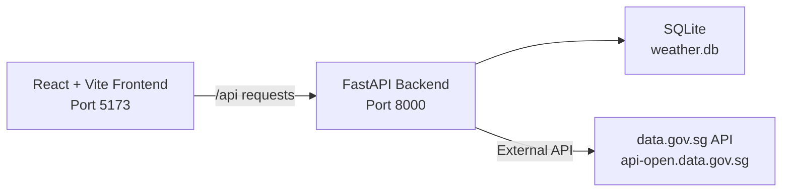

# LionWeather 🦁

AI-powered weather forecasting for Singapore, Malaysia, and Indonesia with real-time data collection and machine learning predictions.

## Overview

LionWeather is an advanced weather intelligence platform that combines real-time weather data from multiple Southeast Asian countries with machine learning to provide accurate forecasts. Named after Singapore's Lion City heritage, it delivers superior predictions by continuously learning from regional weather patterns.

## Features

✨ **Real-time Data Collection**

- Automatic polling from Singapore, Malaysia, and Indonesia weather APIs
- Collects data every 10 minutes from 100+ weather stations
- Stores historical data for ML training

🤖 **Machine Learning Forecasts**

- 24-hour hourly predictions
- 7-day daily forecasts
- Confidence intervals for all predictions
- Automatic weekly model training

🗺️ **Interactive Weather Maps**

- Live radar imagery from Singapore NEA
- Regional weather visualization
- Multi-country coverage

📊 **Advanced Analytics**

- Model performance tracking
- Accuracy metrics and comparisons
- Historical trend analysis

## Tech Stack

**Backend:**

- Python 3.12 + FastAPI
- TensorFlow, Prophet, scikit-learn for ML
- SQLite for data storage
- aiohttp for async API calls

**Frontend:**

- React 18 + Vite
- Tailwind CSS
- Leaflet for maps
- Recharts for visualizations

**APIs:**

- Singapore: data.gov.sg (NEA)
- Malaysia: api.data.gov.my (MET Malaysia)
- Indonesia: data.bmkg.go.id (BMKG)

## Quick Start

### Prerequisites

- Python 3.11+
- Node.js 18+
- uv (Python package manager)

### Installation

1. Clone the repository:

```bash
git clone git@github.com:haomingkoo/lioneweather.git
cd lioneweather
```

2. Set up backend:

```bash
cd backend
uv sync
cp .env.example .env
# Add your API keys to .env
```

3. Set up frontend:

```bash
cd frontend
npm install
cp .env.local.example .env.local
```

### Running Locally

**Backend:**

```bash
cd backend
uv run uvicorn app.main:app --reload --host 0.0.0.0 --port 8000
```

**Frontend:**

```bash
cd frontend
npm run dev
```

Open http://localhost:5173

## Deployment

### Railway (Recommended)

1. Install Railway CLI:

```bash
npm i -g @railway/cli
```

2. Login and deploy:

```bash
railway login
railway up
```

3. Set environment variables in Railway dashboard:

- `DATAGOVSG_API_KEY` - Your data.gov.sg API key
- `DATABASE_PATH` - `/app/weather.db`

### Environment Variables

**Backend (.env):**

```env
DATAGOVSG_API_KEY=your_api_key_here
DATABASE_PATH=weather.db
```

**Frontend (.env.local):**

```env
VITE_API_URL=http://localhost:8000
```

## API Documentation

Once running, visit:

- API Docs: http://localhost:8000/docs
- Health Check: http://localhost:8000/health

### Key Endpoints

**Weather Data:**

- `GET /api/locations` - List all tracked locations
- `POST /api/locations` - Add new location
- `POST /api/locations/{id}/refresh` - Refresh weather data

**ML Predictions:**

- `GET /api/ml/predictions/24h` - 24-hour forecast
- `GET /api/ml/predictions/7d` - 7-day forecast
- `GET /api/ml/metrics/accuracy` - Model accuracy metrics

**Radar & Regional:**

- `GET /api/radar/frames` - Latest radar imagery
- `GET /api/regional/cities` - Regional weather data

## Data Collection

LionWeather automatically collects weather data every 10 minutes:

- **Singapore**: ~50 weather stations (temperature, rainfall, humidity, wind)
- **Malaysia**: ~20 major cities (forecast data)
- **Indonesia**: ~30 locations (BMKG weather data)

**Storage:** ~2,500 records per collection = ~360,000 records/day

**ML Training:** Automatic weekly training every Sunday at 2 AM

## Machine Learning

### Models Used:

- **Prophet** - Time series forecasting with seasonality
- **ARIMA/SARIMA** - Statistical forecasting
- **TensorFlow LSTM** - Deep learning for complex patterns

### Training Requirements:

- **Minimum**: 7 days of data for basic models
- **Recommended**: 30 days for good accuracy
- **Optimal**: 90+ days for seasonal patterns

### Performance:

- Tracks accuracy vs official forecasts
- Automatic model selection based on performance
- Confidence intervals for all predictions

## Project Structure

```
lionweather/
├── backend/
│   ├── app/
│   │   ├── main.py              # FastAPI app
│   │   ├── routers/             # API endpoints
│   │   ├── services/            # Weather APIs, data collection
│   │   ├── ml/                  # ML models and training
│   │   └── db/                  # Database migrations
│   ├── tests/                   # Unit and integration tests
│   ├── pyproject.toml           # Python dependencies
│   └── railway.json             # Railway deployment config
├── frontend/
│   ├── src/
│   │   ├── components/          # React components
│   │   ├── api/                 # API client
│   │   └── App.jsx              # Main app
│   ├── package.json             # Node dependencies
│   └── vite.config.js           # Vite configuration
└── README.md
```

## Contributing

Contributions welcome! Please:

1. Fork the repository
2. Create a feature branch
3. Make your changes
4. Add tests
5. Submit a pull request

## License

MIT License - see LICENSE file for details

## Acknowledgments

- Singapore NEA for weather data API
- Malaysian Meteorological Department
- BMKG Indonesia
- Open source community

## Support

For issues and questions:

- GitHub Issues: https://github.com/yourusername/lionweather/issues
- Documentation: https://github.com/yourusername/lionweather/wiki

---

**LionWeather** - Roaring accurate weather predictions 🦁⚡

## Background

This starter intentionally keeps app features small while including a real external API integration. The goal is to give students a working baseline they can extend using agent-assisted workflows, practicing around API docs, OpenAPI context, and tooling like Postman MCP.

The app tracks locations in Singapore and fetches weather forecasts from the government's open data API. Weather data is stored as snapshots in SQLite — each refresh overwrites the previous reading for that location.

## Tech Stack

| Layer           | Tools                                                  |
| --------------- | ------------------------------------------------------ |
| Backend         | Python 3.11, FastAPI, SQLite (built-in sqlite3), httpx |
| Frontend        | React 18, Vite, Tailwind CSS, Leaflet, React Leaflet   |
| External API    | Singapore data.gov.sg (`api-open.data.gov.sg`)         |
| Dev environment | Flox (manages Node.js + uv)                            |

## Architecture



The Vite dev server proxies `/api/*` requests to the FastAPI backend, so the frontend uses relative URLs.

### Database and refresh flow

The app does **not** call the external weather API on every page load. Instead it uses a snapshot pattern:

1. **Creating a location** (`POST /api/locations`) saves the name and coordinates to SQLite with a placeholder weather status ("Not refreshed"). No external API call is made.
2. **Listing locations** (`GET /api/locations`) reads entirely from SQLite — fast, offline-capable, and never hits rate limits.
3. **Refreshing weather** (`POST /api/locations/{id}/refresh`) is the only operation that calls the data.gov.sg API. It fetches the latest forecast, writes the result back to the same row in SQLite, and returns the updated location.

This means the external API is only called when a user explicitly clicks "Refresh". The frontend can load and display data as often as it wants without burning through rate limits, because every read is served from the local database.

## Project Structure

```text
weather-starter/
├── .flox/
│   └── env/
│       └── manifest.toml                # Flox environment + services
├── backend/
│   ├── pyproject.toml
│   ├── uv.lock
│   └── app/
│       ├── main.py                      # FastAPI app + SQLite init
│       ├── routers/
│       │   └── locations.py             # Location CRUD + refresh endpoints
│       └── services/
│           └── weather_api.py           # Singapore weather API client
└── frontend/
    ├── .env.local.example
    ├── index.html
    ├── package.json
    ├── package-lock.json
    ├── postcss.config.js
    ├── tailwind.config.js
    ├── vite.config.js
    └── src/
        ├── main.jsx                     # React entry point
        ├── App.jsx                      # App wrapper with LocationsProvider
        ├── index.css                    # Tailwind base styles
        ├── api/
        │   ├── client.js               # Base fetch wrapper
        │   └── locations.js            # Location API calls
        ├── hooks/
        │   └── useLocations.jsx        # Context + hooks for location state
        ├── components/
        │   ├── LocationForm.jsx        # Add location form
        │   └── LocationList.jsx        # Location cards + refresh
        └── pages/
            └── Dashboard.jsx           # Main page layout
```

## Quick Start

Install Flox first:  
[https://flox.dev/docs/install-flox/install/](https://flox.dev/docs/install-flox/install/)

Start the Flox environment:

```bash
flox activate
```

Then start services:

```bash
flox services start
```

Open [http://localhost:5173](http://localhost:5173).

Under the hood, `flox services start` runs:

```bash
# Backend (in backend/)
uv sync
uv run uvicorn app.main:app --reload --port 8000

# Frontend (in frontend/)
npm install   # only if node_modules is missing
npm run dev -- --host 127.0.0.1 --port 5173
```

You can run these manually if you need to debug startup issues.

Useful commands:

```bash
flox services status
flox services logs backend
flox services logs frontend
flox services stop
```

Optional:

- Set `WEATHER_API_KEY` as an environment variable if you want to use an API key.
- Change ports in `.flox/env/manifest.toml` (`BACKEND_PORT`, `FRONTEND_PORT`).

## External API Reference

All endpoints are on `https://api-open.data.gov.sg`. No API key is required for basic usage, but you may hit rate limits (HTTP 429) during heavy development.

| Endpoint                                       | Docs                                                                                        | Notes                                                                                                                        |
| ---------------------------------------------- | ------------------------------------------------------------------------------------------- | ---------------------------------------------------------------------------------------------------------------------------- |
| `GET /v2/real-time/api/two-hr-forecast`        | [2-hour Forecast](https://data.gov.sg/datasets/d_3f9e064e25005b0e42969944ccaf2e7a/view)     | Already used in this app. Response includes `area_metadata` (location names + coordinates) and forecast conditions per area. |
| `GET /v2/real-time/api/air-temperature`        | [Realtime Weather Readings](https://data.gov.sg/collections/realtime-weather-readings/view) | Temperature in Celsius from weather stations.                                                                                |
| `GET /v2/real-time/api/relative-humidity`      | [Realtime Weather Readings](https://data.gov.sg/collections/realtime-weather-readings/view) | Humidity percentage from weather stations.                                                                                   |
| `GET /v2/real-time/api/rainfall`               | [Realtime Weather Readings](https://data.gov.sg/collections/realtime-weather-readings/view) | Rainfall in mm from weather stations.                                                                                        |
| `GET /v2/real-time/api/wind-speed`             | [Realtime Weather Readings](https://data.gov.sg/collections/realtime-weather-readings/view) | Wind speed in knots from weather stations.                                                                                   |
| `GET /v2/real-time/api/wind-direction`         | [Realtime Weather Readings](https://data.gov.sg/collections/realtime-weather-readings/view) | Wind direction in degrees from weather stations.                                                                             |
| `GET /v1/environment/24-hour-weather-forecast` | [Weather Forecast](https://data.gov.sg/collections/weather-forecast/view)                   | 24-hour forecast broken into time periods. Different response shape from the 2-hour endpoint.                                |
| `GET /v1/environment/4-day-weather-forecast`   | [Weather Forecast](https://data.gov.sg/collections/weather-forecast/view)                   | 4-day outlook with temperature ranges and forecast text.                                                                     |

### API Key (optional)

If you hit rate limits (HTTP 429), you can register for a free API key:

1. Go to [data.gov.sg](https://data.gov.sg) and create an account
2. Navigate to your profile and generate an API key
3. Set the environment variable before starting the backend:
   ```bash
   export WEATHER_API_KEY=your_api_key_here
   ```
4. Restart the backend — the app sends the key as an `x-api-key` header automatically

---

## What Is Implemented

The app currently supports:

- **Add a location** — latitude + longitude, validated (must be within Singapore) and persisted to SQLite
- **List locations** — all tracked locations with their latest weather snapshot
- **Refresh weather** — `POST /api/locations/{id}/refresh` calls the 2-hour forecast API and saves the result
- **Interactive map view** — Toggle between List and Map views. Map displays all locations as markers with weather popups. Click anywhere on the map to add a new location with automatic weather refresh.
- **Error handling** — duplicate locations (409), missing locations (404), weather API failures (502)

Backend endpoints:

| Method | Endpoint                      | Description                    |
| ------ | ----------------------------- | ------------------------------ |
| `GET`  | `/api/locations`              | List all locations             |
| `POST` | `/api/locations`              | Create a location              |
| `GET`  | `/api/locations/{id}`         | Get a single location          |
| `POST` | `/api/locations/{id}/refresh` | Refresh weather for a location |

Frontend components (all styled with Tailwind CSS utility classes in JSX, no component libraries):

| Component      | File                          | Description                                                                                                                                              |
| -------------- | ----------------------------- | -------------------------------------------------------------------------------------------------------------------------------------------------------- |
| `Dashboard`    | `pages/Dashboard.jsx`         | Single page layout with view toggle. Header with app title and List/Map toggle, then conditional rendering of LocationForm + LocationList or WeatherMap. |
| `ViewToggle`   | `components/ViewToggle.jsx`   | Toggle control to switch between List and Map views.                                                                                                     |
| `LocationForm` | `components/LocationForm.jsx` | Form with latitude and longitude inputs. Clears on success, shows errors inline. Only shown in List view.                                                |
| `LocationList` | `components/LocationList.jsx` | Cards for each saved location showing forecast area as header, condition, valid period, and a "Refresh" button.                                          |
| `WeatherMap`   | `components/WeatherMap.jsx`   | Interactive Leaflet map centered on Singapore. Displays all locations as markers with weather popups. Click map to add new location.                     |

### Using the Map View

1. **Switch to Map view**: Click the "Map" button in the header toggle
2. **View locations**: All saved locations appear as markers on the map
3. **See weather details**: Click any marker to see a popup with weather information
4. **Add a location**: Click anywhere on the map to add a new location at that point
   - The app validates that the location is within Singapore bounds
   - Weather data is automatically fetched after adding
   - The new marker appears immediately with updated weather
5. **Mobile support**: The map supports touch gestures (pinch to zoom, drag to pan)

## Feature Tasks

These tasks are ordered from easiest to hardest. Each one builds on the existing codebase and introduces new concepts progressively.

### 1. Delete a location

Add a `DELETE /api/locations/{id}` endpoint and a delete button to each card in `LocationList.jsx`.

| Layer    | What to do                            |
| -------- | ------------------------------------- |
| Backend  | New DELETE endpoint in `locations.py` |
| Frontend | Delete button in `LocationList.jsx`   |

### 2. Geolocation + auto-detect

"Use my location" button that detects the user's position via the browser, finds the nearest Singapore forecast area, and adds it automatically. Works on `localhost` without HTTPS.

| Layer    | What to do                                                                                                                                       |
| -------- | ------------------------------------------------------------------------------------------------------------------------------------------------ |
| Backend  | No changes needed (nearest-area matching already exists in `weather_api.py`)                                                                     |
| Frontend | New button in `LocationForm.jsx` using [Geolocation API](https://developer.mozilla.org/en-US/docs/Web/API/Geolocation_API). Auto-refresh on add. |

### 3. Singapore area picker

Replace the manual lat/lon inputs with a searchable dropdown. The 2-hour forecast response includes `area_metadata` with area names and coordinates — use that to populate the list.

| Layer        | What to do                                                                                                               |
| ------------ | ------------------------------------------------------------------------------------------------------------------------ |
| Backend      | No changes needed                                                                                                        |
| Frontend     | Replace lat/lon fields in `LocationForm.jsx` with a searchable `<select>` or autocomplete populated from `area_metadata` |
| External API | `GET /v2/real-time/api/two-hr-forecast` → `area_metadata` array                                                          |

### 4. Current conditions detail

Show temperature, humidity, and rainfall alongside the forecast condition. All three endpoints share the same response shape — station readings with coordinates.

| Layer        | What to do                                                                                                           |
| ------------ | -------------------------------------------------------------------------------------------------------------------- |
| Backend      | New methods in `weather_api.py`, new columns in `main.py`, extend the refresh endpoint                               |
| Frontend     | Redesign location cards to show current temp prominently, with humidity and rainfall as secondary details            |
| External API | `GET /v2/real-time/api/air-temperature`, `GET /v2/real-time/api/relative-humidity`, `GET /v2/real-time/api/rainfall` |

### 5. Hourly and multi-day forecast

Add a scrollable hourly timeline and a 4-day daily forecast below each location's current conditions. The 24-hour endpoint returns periods (morning, afternoon, night) by region. The 4-day endpoint returns daily high/low temperature ranges and outlook text. Both are `v1` endpoints with different response shapes from the 2-hour API.

| Layer        | What to do                                                                                                       |
| ------------ | ---------------------------------------------------------------------------------------------------------------- |
| Backend      | New service methods + endpoints (e.g. `GET /api/locations/{id}/forecast`)                                        |
| Frontend     | Horizontally scrollable hourly row + vertical daily list, each showing condition icon/text and temperature range |
| External API | `GET /v1/environment/24-hour-weather-forecast`, `GET /v1/environment/4-day-weather-forecast`                     |

### 6. Wind and atmospheric readings

Add a wind and atmosphere section showing wind speed, direction, and pressure. Display wind as a compass arrow or animated indicator.

| Layer        | What to do                                                                  |
| ------------ | --------------------------------------------------------------------------- |
| Backend      | New methods in `SingaporeWeatherClient`, extend refresh or add new endpoint |
| Frontend     | New `WindCompass` or similar component showing direction + speed visually   |
| External API | `GET /v2/real-time/api/wind-speed`, `GET /v2/real-time/api/wind-direction`  |

### 7. UI overhaul

Redesign the app layout and styling. Use gradient backgrounds, glassmorphism cards, weather condition icons, and smooth transitions. Aim for a polished, modern look — think translucent panels, large temperature display, and condition-appropriate color themes (blue for rain, warm tones for sun).

| Layer    | What to do                                                                                                                                                                     |
| -------- | ------------------------------------------------------------------------------------------------------------------------------------------------------------------------------ |
| Backend  | No changes needed                                                                                                                                                              |
| Frontend | Restyle all existing components with Tailwind. Add weather icons (e.g. [Lucide](https://lucide.dev/) or custom SVGs). Consider animated backgrounds or condition-based themes. |

### 8. Interactive map

Add a full-screen map view of Singapore. Show all saved locations as pins with weather popups. Tapping the map adds a new location. Overlay a rainfall or temperature heatmap layer using station data from Tasks 4/6.

| Layer        | What to do                                                                                                                                                                     |
| ------------ | ------------------------------------------------------------------------------------------------------------------------------------------------------------------------------ |
| Backend      | New endpoint to return all station readings as GeoJSON (for heatmap overlay)                                                                                                   |
| Frontend     | New `WeatherMap` component using [Leaflet](https://leafletjs.com/) + [React Leaflet](https://react-leaflet.js.org/). Toggle between map view and list view in `Dashboard.jsx`. |
| NPM packages | `leaflet`, `react-leaflet`                                                                                                                                                     |

### 9. Location detail page with charts

Add a detail view for each location. Show historical readings over time as line charts (temperature, rainfall, humidity). Requires storing each refresh as a separate row instead of overwriting.

| Layer        | What to do                                                                                                                                                                                |
| ------------ | ----------------------------------------------------------------------------------------------------------------------------------------------------------------------------------------- |
| Backend      | New `readings` table (one row per refresh). New endpoint for time-series data.                                                                                                            |
| Frontend     | New detail page/route with charts using [Recharts](https://recharts.org/) or [Chart.js](https://www.chartjs.org/). Add client-side routing with [React Router](https://reactrouter.com/). |
| NPM packages | `react-router-dom`, `recharts` or `chart.js`                                                                                                                                              |

### 10. Multi-location management

Support reordering locations (drag-and-drop or manual up/down), setting a default/primary location, and swiping between locations on mobile. The primary location shows first on launch.

| Layer    | What to do                                                                                         |
| -------- | -------------------------------------------------------------------------------------------------- |
| Backend  | New `position` column for sort order, new endpoint to reorder                                      |
| Frontend | Drag-and-drop with [@dnd-kit](https://dndkit.com/) or similar. Swipeable location cards on mobile. |
